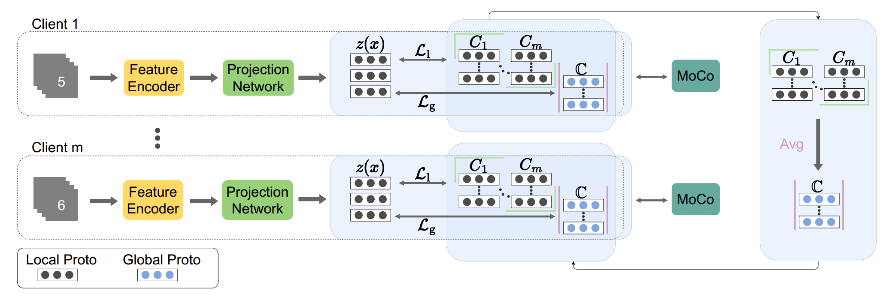

# **Project Introduction**
This is the official implementation of the following paper:
**A Prototype-Wise Momentum Based Federated Contrast Learning** 
***
In this paper, we propose the **fedPMC** algorithm, which solves the overfitting problem by combining **real-time local prototypes** with **momentum comparison**, and uses prototypes as communication carriers to reduce **bandwidth consumption**.
***

# **Getting Started**
## **Dependencies**
This code requires as following
- conda 24.7.1
- python 3.12.0
- PyTorch 2.5.1
- Torchvision 0.20.1
- numpy 1.26.4
- pandas 2.2.3

You can configure the environment with the following command
```bash
conda install --yes --file requirements.txt
```
## Datasets
- Please download our datasets [here](https://drive.google.com/drive/folders/1xLxaz3zJRqZbTVDzkoAoWZiX50gwZI_4?usp=sharing), put under `./data/` directory.
- The directory structure of the data folder after the data is added is
```.
data
├── digit_five
│   ├── SubDataset[MNIST | MNIST_M | SVHN | SynthDigits | USPS] // SubDataset
│   │   ├── train.pkl                                           // Full training set
│   │   └── test.pkl                                            // Full test set
```
## Weights
- Please download our datasets [here](https://drive.google.com/drive/folders/1xLxaz3zJRqZbTVDzkoAoWZiX50gwZI_4?usp=sharing), put under `./lib/models/weights/` directory.
- The directory structure of the weights folder after the weights is added is
```.
weights
├── Subfolder[aircraft-net | birds-net | quickdraw-net]    // Subfolder
│   └── model_best.pth.tar                                 // Pre-trained weight file
```
## Usage
### Train & Test
Please using following commands to train and test federated learning strategy.
- **--alg** specify federated learning strategy, option: solo | fedavg | fedpcl | pfedme | perfedavg | fedrep | fedproto | ours
- **--dataset** specify datasets, option: digit
- **--rounds** iterations for communication
- **--local_bs** batch size of local training
- Of course, you can statically set other parameters through the parameter configuration file `./lib/option.py`
```bash
cd exps
# benchmark experiment in digit_five dataset
python federated_main.py --mode ours --dataset digit --rounds 100 --local_bs 128
```
